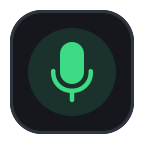
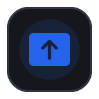

# TeamDeck

### Drive a Microsoft Teams meeting straight from your Elgato Stream Deck.

  
  
  
  
  
  

Not affiliated with or endorsed by Microsoft or Elgato; "Microsoft Teams" and "Stream Deck" are trademarks of their respective owners.

## Features

|  |  |  |  |  |  |
| :-: | :-: | :-: | :-: | :-: | :-: |
|  |  |  |  |  |  |
| **Mute** | **Camera** | **Raise hand** | **Leave** | **In meeting** | **Screen sharing** |
|  |  |  |  |  |  |
| Applause | Laugh | Like | Love | Surprised |  |

### Availability (opt-in)

A read-only tile mirrors your Microsoft Teams presence — Available, Busy, Do Not Disturb, Be Right
Back, Away, Offline, and In a meeting. Presence is read from your local New Teams log, so it stays
off until you tick **Allow reading status via Teams logs** in the tile's property inspector. Only the
availability word is read (no messages, contacts, or meeting titles), and nothing leaves your machine.

Teams' finer activities roll up to these states, using the same colours Teams does: *In a call* shows
as Busy and *Presenting* as Do Not Disturb, while *In a meeting* is detected directly. (Distinguishing
those activities would require signing in to Microsoft Graph, which this tile deliberately avoids.)

## Install

Download the latest from the [Releases page](https://github.com/teh-hippo/teamdeck/releases) — the Stream Deck app installs it for you. No Node, terminal, or build tools required.

## Contributing

See [CONTRIBUTING.md](CONTRIBUTING.md).

## Licence

This project is licensed under the MIT Licence - see the [LICENSE](LICENSE) file for details.
